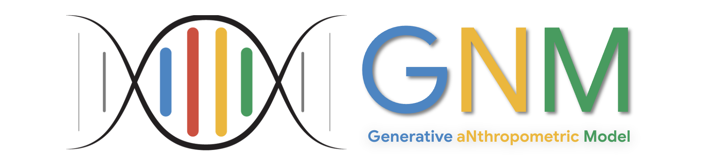

# GNM: Generative aNthropometric Model and Ecosystem



Welcome to the **GNM Ecosystem** repository. GNM - pronounced as genome
(/ˈdʒiː.noʊm/) in reference to the human genome - strives to be the most
accurate and complete 3D parametric human model.

3D Morphable Models (3DMMs) are widely used across computer vision, computer
graphics, and generative AI for representing human geometry and appearance. GNM
introduces a state-of-the-art family of parametric statistical human models and
its associated perception stack.

Our roadmap includes releasing a comprehensive suite of statistical models
complemented by perception and analysis technology. To facilitate early
community research and open development, we are beginning our open-source
release with **GNM Head**, our high-fidelity statistical 3D model of the human
head.

The ecosystem is released under the Apache 2.0 permissive license suitable for
both non-commercial and commercial applications.

## News

  - [2026-07-28]: Official [technical report](https://arxiv.org/abs/2607.23687) for the GNM Head released! 🚀🚀🚀

## GNM Ecosystem Packages

Here we list all the available GNM packages:

| Package | Description | Status | Teaser |
| :---: | :--- | :---: | :---: |
| **[GNM Head](gnm/shape/README.md)**  | Parametric 3D statistical human head and face geometry model providing fine-grained, disentangled control over identity, expressions, and head pose. The model contains controllable internal anatomy including eyeballs, teeth and tongue. Includes multi-framework backend support for **NumPy**, **JAX**, **PyTorch**, and **TensorFlow**, along with semantic parameter sampling. <br><br>*Technical report*: [GNM Head: A Generative aNthropometric Model of the human head](https://arxiv.org/abs/2607.23687) | [](https://github.com/google/gnm/actions/workflows/ci-shape-linux.yml)<br>[](https://github.com/google/gnm/actions/workflows/ci-shape-macos.yml)<br>[](https://github.com/google/gnm/actions/workflows/ci-shape-windows.yml)<br>[](https://github.com/google/gnm/actions/workflows/lint.yml) |  

## Citation
If you use any part of the GNM Ecosystem in your work, please consider citing
the corresponding package. Relevant bibtex entries are listed below as well as
within the individual packages.

**GNM Head**

```bash
@article{ploumpis2026gnmhead,
  title={GNM Head: A Generative aNthropometric Model of the human head},
  author={Ploumpis, S. and Bednarik, J. and Zoss, G. and Guseinov, R. and Prasso, L. and Chandran, P. and Boyne, O. and Choutas, V. and Bolkart, T. and Wang, D. and Chai, M. and Qiu, D. and Winberg, S. and Rainer, G. and Bridgeman, L. and Vicini, D. and Riviere, J. and Boetzel, Y. and Koumis, A. and Busch, J. and Herrera, C. and Still, J. and Ysebert, S. and Lincoln, P. and Escolano, S. O. and Rhemann, C. and Wood, E. and Beeler, T. and Zafeiriou, S.},
  year={2026},
  eprint={2607.23687},
  archivePrefix={arXiv},
  url={https://arxiv.org/abs/2607.23687},
}
```

## Contributing
We'd love to accept your patches and contributions to this project! See
[CONTRIBUTING.md](CONTRIBUTING.md) for more information on how to get started
and how we handle external contributions.

## License
This project is licensed under the Apache License, Version 2.0. See the
[LICENSE](LICENSE) file for details.
